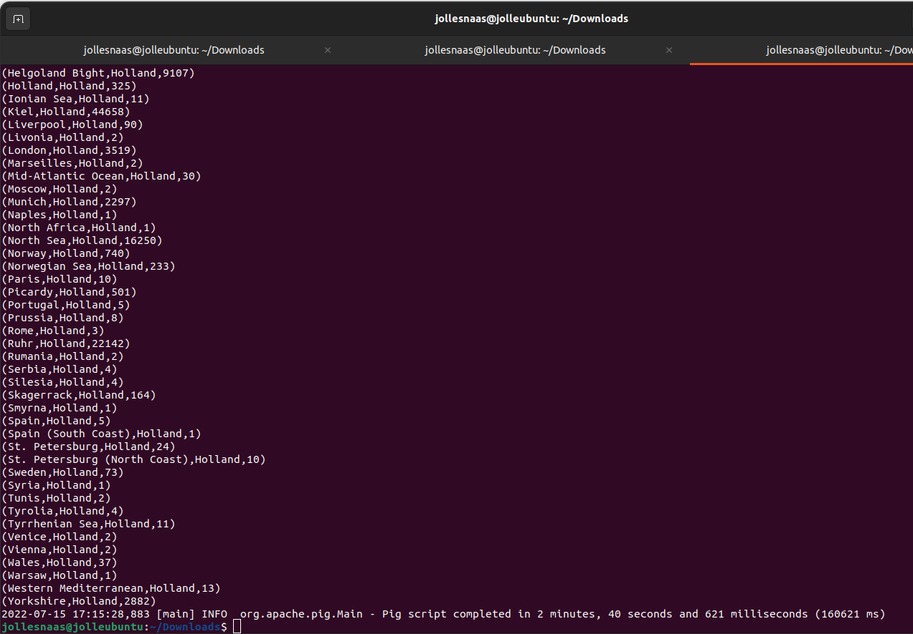

## Assignment 2
Jolle Snaas - 644546
[https://github.com/J0113/PDP](https://github.com/J0113/PDP)

**How to run?**

0. Install Hadoop + Pig
  - Use a cloudera VirtualBox image
  - or
  - Install [hadoop](https://hiberstack.com/how-to-install-hadoop-in-ubuntu/) and [pig](https://hiberstack.com/install-apache-pig-in-ubuntu/) on a Linux machine.

1. Copy the `orders.csv` file from Moodle to HDFS
- Use the online file browser to upload
- or
- Upload using the terminal with the following command: `hadoop fs -put orders.csv /hadoop`

2. Execute with pig
- `pig assignment2.pig` (make sure that assignment2.pig is in the current dir)

3. Wait a while....

5. Check the output. (it should show in the terminal)

